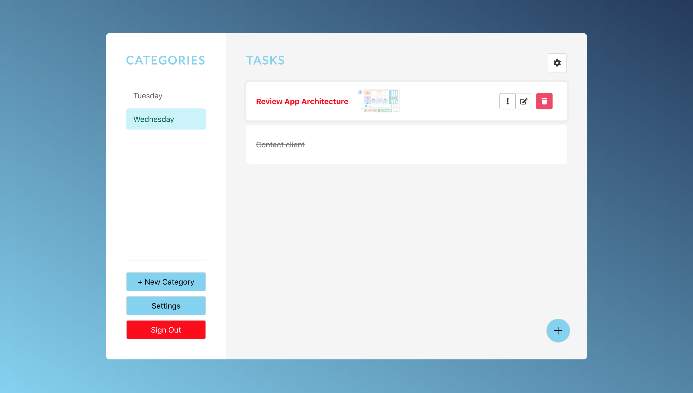

#

 Welcome to Greg's Task Manager!
 
 
 
## Contents
- [Prerequisites](#Prerequisites)
- [How It Works](#How-It-Works)
- [How To Start](#How-To-Start)

## Prerequisites

This application was create using the MEAN stack (**MongoDB**, **Express**, **Angular**, **Node.js**). Information on installing Node on your machine and starting an instnace of MongoDB through **Docker** can be found [here](https://medium.com/zenofai/how-to-build-a-node-js-and-mongodb-application-with-docker-containers-15e535baabf5). 

## How It Works

The application first authenticates a user then redirects them to the task manager. The following operations can be performed:
- Configure app display name
- Configure app background color
- Create a user
- Authenticate a user
- Maintain sessions through the use of JSON Web Tokens
- End a user session
- Create a category
- Rename a category
- Delete a category
- Create a task in category
- Rename a task
- Attach a file/image attachment to a task
- Mark a task as complete
- Mark a task as high priority
- Delete a task
- Send daily email summary of all categories/tasks to each user



## How To Start

The application can be used by following these steps:
1. Run the container on Docker Desktop to start a MongoDB instance
2. Run the following command in the api folder to start the api and connect it to MongoDB:
```
nodemon app.js
```
3. Run the following command in the frontend folder to start the Angular app:
```
ng serve
```
4. Open localhost:4200 in a web browser to access Greg's Task Manager

